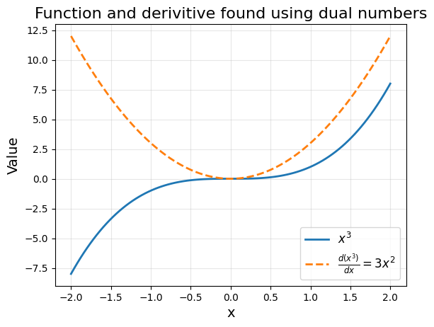

Example Notebook
=================

You may run this notebook yourself via the dual_autodiff.ipynb notebook in the Coursework repository. 

First import the Dual class from the `dual_autodiff` package. The `Dual` class houses all the functionality required to use Dual numbers.

.. code-block:: python

   # Import package
   from dual_autodiff import Dual

Initialising Dual Numbers
-------------------------
Initialise our Dual number object, giving it a real and a dual part. The real and dual parts may be either integers or floating point numbers.

.. code-block:: python

   # Initialising Dual numbers
   dual_number_1 = Dual(1, 2)
   dual_number_2 = Dual(3.5, 4.5)

   print(dual_number_1)
   print(dual_number_2)

**Output**

.. code-block:: text

    Dual(real = 1, dual = 2)
    Dual(real = 3.5, dual = 4.5)

Attempting to initialise with a non-int or float object will result in an error:

.. code-block:: python

   try:
       d = Dual("string", 1) 
   except TypeError as e:
       print("An error occurred:")
       print(e)

**Output**

.. code-block:: text

    An error occurred: "real component must be either a float or an integer"

Supported Operations
---------------------
The `dual_autodiff` package supports a wide array of operations suitable for scientific computing, such as arithmetic operations, trigonometric operations, logarithms, and exponentials. Moreover, it handles cases where a Dual number object is being operated on with a scalar, treating the scalar as a Dual number with a dual part of zero.

Arithmetic Operations Example
~~~~~~~~~~~~~~~~~~~~~~~~~~~~~~

Addition between two Dual objects

.. code-block:: python

   dual_number_3 = dual_number_1 + dual_number_2
   print(dual_number_3)

**Output**

.. code-block:: text

    Dual(real = 4.5, dual = 6.5)

Multiplication between two dual objects

.. code-block:: python

   dual_number_4 = dual_number_1 * dual_number_2
   print(dual_number_4)

**Output**

.. code-block:: text

    Dual(real = 3.5, dual = 11.5)

Division between two dual objects

.. code-block:: python
    
   dual_number_5 = dual_number_1 / dual_number_2
   print(dual_number_5)

**Output**

.. code-block:: text

    Dual(real = 0.2857142857142857, dual = 0.20408163265306123)

Dual number raised to another dual number

.. code-block:: python

   dual_number_6 = dual_number_1 ** dual_number_2
   print(dual_number_6)

**Output**

.. code-block:: text

    Dual(real = 1.0, dual = 7.0)

Operations with Scalars
~~~~~~~~~~~~~~~~~~~~~~~
One may add a scaler to a dual number.

.. code-block:: python

   dual_number_7 = 2 + dual_number_2
   print(dual_number_7)

**Output**

.. code-block:: text

        Dual(real = 5.5, dual = 4.5)

Division of a scalar with a dual object

.. code-block:: python

   dual_number_8 = 2 / dual_number_2
   print(dual_number_8)

**Output**  

.. code-block:: text

    Dual(real = 0.5714285714285714, dual = -0.7346938775510204)

Dual to a scalar power

.. code-block:: python

   dual_number_9 = dual_number_1 ** 2
   print(dual_number_9)

**Output**  

.. code-block:: text

    Dual(real = 1, dual = 4)

Chaining Operations
~~~~~~~~~~~~~~~~~~~
Operations can also be chained together following Python’s standard rules for order of operations.

.. code-block:: python

   dual_number_10 = (dual_number_1 + dual_number_2) ** 2 / dual_number_4
   print(dual_number_10)

**Output**  

.. code-block:: text    

   Dual(real = 5.785714285714286, dual = -2.295918367346939)

Trigonometric Functions Example
~~~~~~~~~~~~~~~~~~~~~~~~~~~~~~~
Trigonometric functions are also defined for Dual numbers as methods of the `Dual` class.

.. code-block:: python

   # Standard trig functions
   sin = dual_number_1.sin()
   cos = dual_number_1.cos()
   tan = dual_number_1.tan()

   print("The sine of {} is {}".format(dual_number_1, sin))
   print("The cosine of {} is {}".format(dual_number_1, cos))
   print("The tangent of {} is {}".format(dual_number_1, tan))

**Output**  

.. code-block:: text    

    The sine of Dual(real = 1, dual = 2) is Dual(real = 0.8414709848078965, dual = 1.0806046117362795)
    The cosine of Dual(real = 1, dual = 2) is Dual(real = 0.5403023058681398, dual = -1.682941969615793)
    The tangent of Dual(real = 1, dual = 2) is Dual(real = 1.557407724654902, dual = 6.851037641629518)

Chaining Trigonometric Methods
~~~~~~~~~~~~~~~~~~~~~~~~~~~~~~~
To compute a nested expression like:

.. math::

   \tan(\cos(\sin(Dual))),

One must work "inside out". This is becuase trigonmetric functions have been implemented as methods of the dual instance.

.. code-block:: python

   x = dual_number_1.sin().cos().tan()
   print(x)

**Output**  

.. code-block:: text    

    Dual(real = 0.786357394978223, dual = -1.3039512770666613)

Hyperbolic Functions Example
~~~~~~~~~~~~~~~~~~~~~~~~~~~~~

.. code-block:: python

   sinh = dual_number_1.sinh()
   cosh = dual_number_1.cosh()
   tanh = dual_number_1.tanh()

   print("sinh({}) = {}".format(dual_number_1, sinh))
   print("cosh({}) = {}".format(dual_number_1, cosh))
   print("tanh({}) = {}".format(dual_number_1, tanh))

**Output**  

.. code-block:: text 

    The sinh of Dual(real = 1, dual = 2) is Dual(real = 1.1752011936438014, dual = 3.0861612696304874)
    The cosg of Dual(real = 1, dual = 2) is Dual(real = 1.5430806348152437, dual = 2.3504023872876028)
    The tanh of Dual(real = 1, dual = 2) is Dual(real = 0.7615941559557649, dual = 0.8399486832280524)

Exponentials and Logarithms
~~~~~~~~~~~~~~~~~~~~~~~~~~~
Natural logarithms and exponentials are also supported. Akin to other mathematic functions in this module, log and exp are methods of the class and take in the current instance as the argument.

.. code-block:: python

   ln = dual_number_1.log()
   exp = dual_number_1.exp()

   print("ln({}) = {}".format(dual_number_1, ln))
   print("exp({}) = {}".format(dual_number_1, exp))

**Output**  

.. code-block:: text 

    ln(Dual(real = 1, dual = 2)) = Dual(real = 1.1752011936438014, dual = 3.0861612696304874)
    exp(Dual(real = 1, dual = 2)) = Dual(real = 1.5430806348152437, dual = 2.3504023872876028)

The exponential and logarithm of dual numbers follow what one would expect 

.. code-block:: python

    print(dual_number_1)
    print(dual_number_1.exp().log())

**Output**  

.. code-block:: text 

    Dual(real = 1.0, dual = 2.0)
    Dual(real = 1.0, dual = 2.0)

Comparison Operations
~~~~~~~~~~~~~~~~~~~~~~
Two Dual numbers are considered equal if their real and dual parts match (within a small tolerance).

.. code-block:: python

   dual1 = Dual(1, 1)
   dual2 = Dual(1, 1)

   print(dual1 == dual2)

**Output**  

.. code-block:: text 

    True

Differentiation Example
-----------------------
A key use case for Dual numbers is autodifferentiation, where:

.. math::

   f(a + b\epsilon) = f(a) + f'(a) \, b\epsilon

By setting :math:`b = 1`, you can compute a function and its derivative evaluated at :math:`a` to machine precision.

.. code-block:: python

   import numpy as np
   from matplotlib import pyplot as plt

   # Example function
   def func(x):
       return x**3

   # Region of interest
   x = np.linspace(-2, 2, 100)

   # Initialize Dual numbers
   dual_numbers = [Dual(elem, 1) for elem in x]

   # Evaluate function
   dual_outputs = [func(d) for d in dual_numbers]

   # Extract real and dual parts
   real_outputs = [d.real for d in dual_outputs]
   dual_outputs = [d.dual for d in dual_outputs]

   # Plot results
   plt.plot(x, real_outputs, label="$x^3$", linewidth=2)
   plt.plot(x, dual_outputs, label="$\\\\frac{d(x^3)}{dx} = 3x^2$", linestyle="--", linewidth=2)

   plt.title("Function and derivative using Dual numbers", fontsize=16)
   plt.xlabel("x", fontsize=14)
   plt.ylabel("Value", fontsize=14)
   plt.legend(fontsize=12)
   plt.grid(alpha=0.3)
   plt.show()

